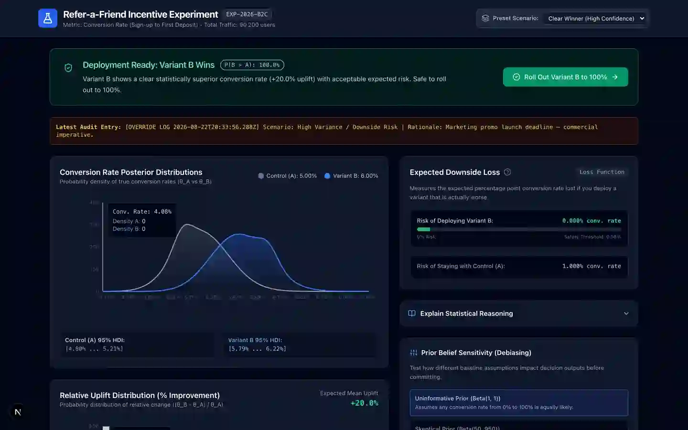
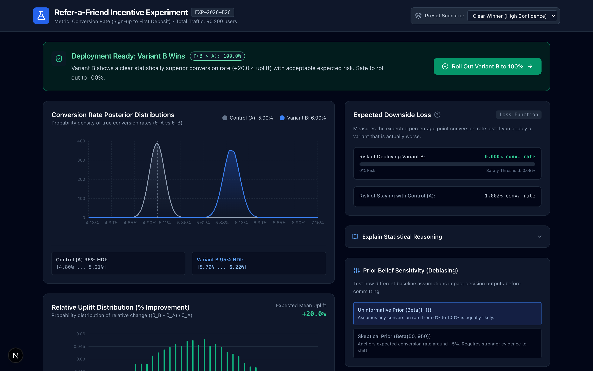
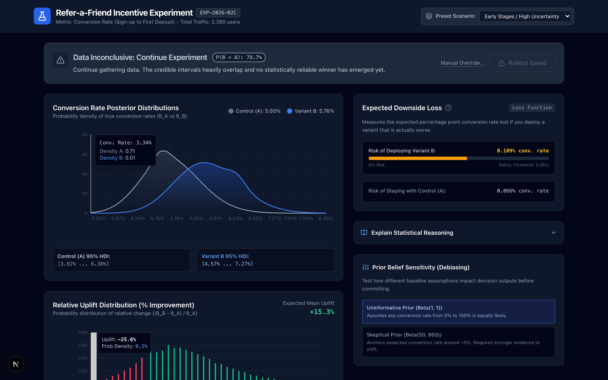
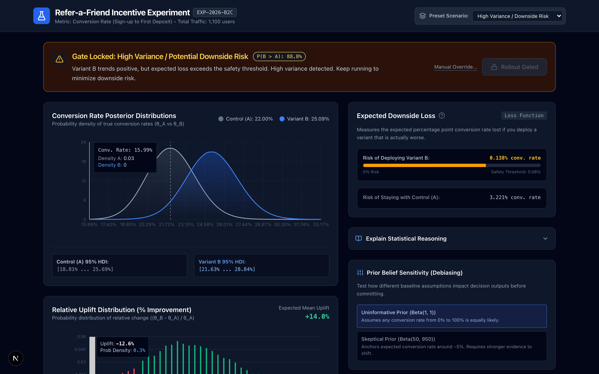
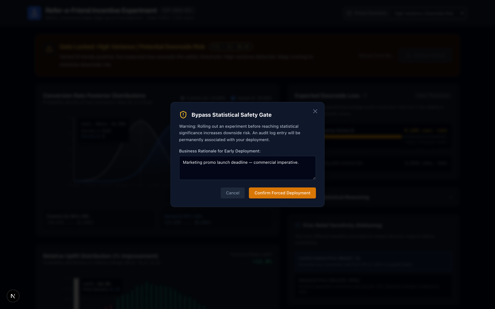
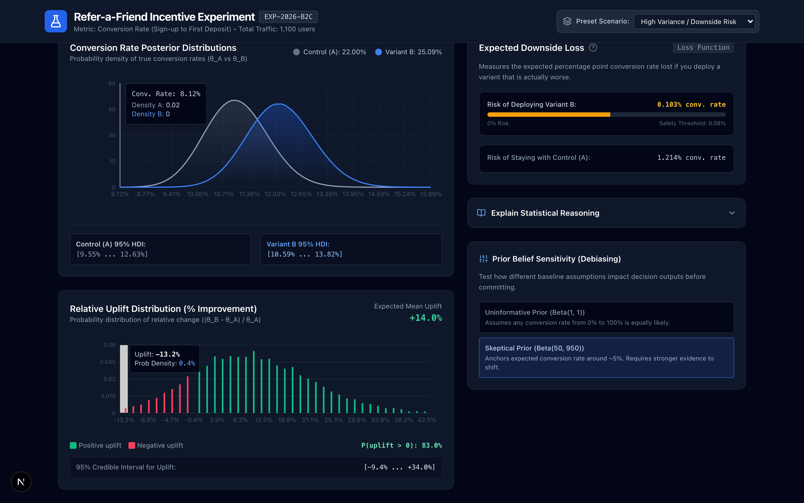

<div align="center">

# Adaptive Bayesian A/B Testing Dashboard

**Turn experimental uncertainty into safe, auditable, business-relevant rollout decisions.**

`#Next.js` · `#TypeScript` · `#Recharts` · `#BayesianA/B` · `#ProductDecisioning`

[Run the demo](#-quickstart-) · [Case study](./docs/product-case-study.md) ·
[Architecture](./docs/architecture.md) · [Statistics](./docs/statistical-model.md)

</div>

---


## Project Vision

Most A/B dashboards answer one misleading question — *"which variant is statistically
significant?"* This project inverts that framing. It answers the question product
managers actually act on — **"is it *safe* to ship this, and what does it cost me if
I'm wrong?"** — by making **uncertainty, expected loss, and guardrailed rollout
decisions** the primary interface.

Built through an **agentic-coding** workflow (an AI pair-programming process that
translated a detailed spec into a complete, verifiable, runnable build), it is a
compact but complete demonstration of how Bayesian statistics, human-in-the-loop
guardrails, and progressive disclosure compose into a single **product decisioning**
experience.

## The Problem Space

Experimentation teams do not fail from a lack of p-values — they fail from a lack of
**decision context**:

- **False precision.** A point estimate hides how unsure the data really is — teams
  ship "winners" that were never truly distinct, or stall waiting for significance
  that never arrives.
- **Unquantified downside risk.** Rolling out a variant is a real business bet, yet
  almost no one estimates how much conversion (or revenue) is at risk before committing.
- **Black-box decisions.** When a rollout happens, the "why" lives in a data
  scientist's notebook — leaving no audit trail and no accountability.
- **Invisible assumptions.** Conclusions quietly depend on the prior belief, but
  tooling never lets a team stress-test how much that assumption changes the answer.

This is a **product and decisioning** problem — not a statistics problem — and that is
where the product design effort went.
## The Solution

I designed and built this as a **decision product**, using an **agentic coding**
workflow (a detailed AI-pair implementation brief compiled into a complete, verified
Next.js build). Three product moves carry the thesis:

**1. Put the decision — not the p-value — at the center.**
A single status banner renders the answer (`WINNER_B`, `WINNER_A`, `INCONCLUSIVE`,
`HIGH_RISK`) with `P(B > A)` called out. The rollout control is **gated** by the
decision: it is physically disabled unless the engine proves both `P(B>A) ≥ 0.95`
**and** Expected Loss within the safety threshold.

**2. Quantify the two-sided cost.**
Every choice has real downside risk. The dashboard computes **Expected Loss for
deploying B** *and* **for staying with A**, rendered as an explicit safety-threshold
meter — turning "maybe risky?" into a number a stakeholder can compare.

**3. Make every assumption visible and every override accountable.**
- **Progressive disclosure:** a business-readable recommendation up front; one click
  reveals the full math and the guardrail logic.
- **Prior sensitivity:** switch uninformative ↔ skeptical priors and watch the whole
  posterior + status recompute live.
- **Auditable override:** a locked rollout can still be overridden, but only with a
  written business rationale that is timestamped into an audit log.

## Visual Walkthrough

### [▶️ CLICK HERE TO VIEW THE DEMO RECORDING](./assets/r_demo/dashboard-walkthrough.webp)


The dashboard supports five distinct decision states. Each state changes the
banner, the rollout gate, the charts, and the risk meters — proving the
interface is wired to the Bayesian engine, not hard-coded.

### 1 — Clear Winner (gate unlocked)

Variant B dominates on both probability **and** expected loss. The rollout
button turns green and fires.

<p align="center">
  
</p>

### 2 — Inconclusive (honest uncertainty)

Low sample size, heavily overlapping posteriors. The engine says *keep
gathering data* — the gate stays locked.

<p align="center">
  
</p>

### 3 — High Risk (the locked gate)

Variant B looks likely better (~89% probability), but the expected loss
exceeds the safety threshold. The guardrail refuses rollout despite the
favorable probability — *probably better is not enough*.

<p align="center">
  
</p>

### 4 — Override + Audit Trail

A locked rollout can still be overridden, but only with a typed business
rationale. The audit log makes every risky decision traceable and
accountable.

<p align="center">
  
</p>

### 5 — Prior Sensitivity (assumption stress-test)

Switching from an uninformative to a skeptical prior recomputes the entire
surface live — making the influence of assumptions visible before anyone
commits.

<p align="center">
  
</p>


## Product Impact

| Decision capability | How the product delivers |
| --- | --- |
| **Clarity** | A single banner communicates status + `P(B>A)` — no tables to parse |
| **Risk transparency** | Expected Loss shown for B *and* A against the safety threshold |
| **Safety by design** | Rollout button locked unless probability *and* loss cross explicit bars |
| **Accountability** | Early rollout requires typed rationale → timestamped audit entry |
| **Assumption testing** | Prior switch recomputes live; bias becomes visible, not implicit |
| **Statistical honesty** | 10,000-draw Monte Carlo engine; HDIs; no black-box "winner" |

**What this evidences as a portfolio piece:**
- **Product thinking** — the artifact is a *decisioning* product, not just charts.
- **Crossover expertise** — speaks statistics, product UX, and engineering risk.
- **Agentic delivery** — a complete, *running*, verified build produced end-to-end,
  polished and calibrated.

## Quickstart

> No coding knowledge required to *open* the app — you only need a couple of
> free tools and to copy-paste two commands. Here is the full, gentle walkthrough.

### 1. Install the prerequisites (once)

You need **Node.js** (a free program that runs this app) and **Git** (optional, for
downloading this repo). Both are free and safe.

- **Node.js:** download the "LTS" version from <https://nodejs.org/>, then double-click
  the installer and follow the defaults.
- **Git:** on macOS it's usually already installed. If not, download from
  <https://git-scm.com/>.

To confirm they're ready, open a terminal (see step 3) and run:

```bash
node --version
npm --version
```

You should see version numbers (e.g. `v22` and `10.x`). If a command is "not found",
reinstall that tool and restart your terminal.

### 2. Get the project files

Download or clone the repository into a folder on your computer, then open a terminal
**inside that folder**. If you cloned it:

```bash
git clone <your-repo-url>
cd bayesian-ab-dashboard
```

### 3. Open a terminal (the little text window)

- **Windows:** search for "Command Prompt" or "PowerShell".
- **macOS:** search for "Terminal".
- Either is fine. You'll paste commands into it.

### 4. Install the app's code library

Copy-and-paste this into the terminal (in the project folder) and press Enter. This
downloads all the pieces the app needs and usually takes under a minute:

```bash
npm install
```

You should see progress rows and finally something like `added N packages`. (If you
see a long red error, skip to [Troubleshooting](#troubleshooting).)

### 5. Start the app

Copy-and-paste this and press Enter:

```bash
npm run dev
```

You'll see ` Next.js 15` and a line like `- Local: http://localhost:3000`. **Leave this
window open** — the app is now running.

### 6. Open the dashboard

Open any browser (Chrome, Edge, Safari, Firefox) and go to **http://localhost:3000**.
You should see the dark **"Adaptive Bayesian A/B Testing Dashboard"**.

- Use the **"Preset Scenario"** dropdown in the top-right to switch between three live
  decision worlds: **Clear Winner**, **Inconclusive**, and **High Risk**.
- The dashboard computes 10,000 sample "posterior" draws in your browser, so the charts
  and decision banner update immediately.
- To stop the app later, go back to the terminal and press **Ctrl + C**.

### What "it's working" looks like

- You see a dark dashboard with: a **decision banner** at the top, two **charts** on the
  left, and **risk / reasoning / sensitivity** panels on the right.
- Selecting each scenario changes the banner, the gate button, the charts, and the risk
  meters. In **Clear Winner** the rollout button is green and clickable; in the others it
  is locked (grey).

### Troubleshooting

| Problem | What to do |
| --- | --- |
| `'node' is not recognized` / `node: command not found` | Install Node.js (as in step 1) and restart your terminal. |
| `npm install` says `EACCES` / permission denied | Try `npm install --no-scripts` then `npm run dev`; or contact your system admin regarding global npm permissions. |
| The browser says "can't connect / refused" | Make sure the terminal window from **step 5** is still open, then refresh http://localhost:3000. |
| Port already in use | Run `PORT=3001 npm run dev` (or `set PORT=3001 && npm run dev` on Windows) and open http://localhost:3001. |
| **The UI appears but buttons don't respond** | This can happen if a stale build cache exists after updating. Stop the server (Ctrl+C) and run: `npm run build` then `npm run dev` again. |

### Problems for developers

For a development build:

```bash
npm run build && npm run start
```

That is everything you need. Scroll down for architecture, docs, and how to extend it.

## Structure

```
src/
├── app/                  Next.js App Router (layout, page, global styles)
├── components/
│   ├── dashboard/        Feature widgets: banner, charts, risk, inspector
│   └── ui/               Stateless primitives: badge, button, card, dialog, …
└── lib/                  Pure statistics: Bayesian engine, types, scenarios, utils
docs/                     Product narrative, PRD, architecture, model, demo script
assets/                   Screenshots + the recorded walkthrough
```

### Why this flow

- **`src/lib`** keeps the statistics a pure, testable module — the first hardening as
  this becomes a production service.
- **Stateless `ui/` primitives** keep visual language consistent across dashboards.
- **Page-level composition** in `src/app/page.tsx` makes the product a configurable
  assembly — additive, not invasive, as scope grows.

## Documentation

| Doc | Purpose |
| --- | --- |
| [Product case study](./docs/product-case-study.md) | The **why** — problem, thesis, impact, roadmap |
| [Product requirements (PRD)](./docs/product-requirements.md) | Jobs-to-be-done, FRs, acceptance criteria |
| [Architecture](./docs/architecture.md) | How the system maps to product outcomes |
| [Statistical model](./docs/statistical-model.md) | The math — accessible, no black box |
| [Visual walkthrough](./docs/visual-walkthrough.md) | The recorded demo + narration script |

## Tech Stack

**Next.js 15 (App Router, TypeScript)** · **Recharts** · **Tailwind CSS** · **Lucide**
· **Monte Carlo Beta-Binomial engine** (`src/lib`, zero heavy dependencies)

---
